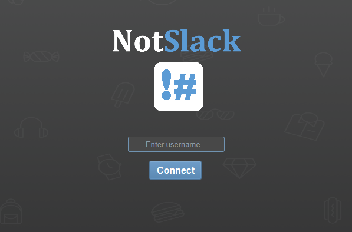

# NotSlack - Chat Application
Chat application created with Java object-oriented programming, MySQL database and JavaFX.
Users are able to chat with one other user (direct messaging) or with multiple users (group chat).



## Technologies
- Java programming with object-oriented principles
- MySQL and JDBC
- JavaFX 8
- TestNG testing framework

## Application Features
- intuitive and user friendly UI
- user @ mentioning
- direct messaging
- creating and joining groups (chat rooms) and group chatting

## How to Setup
1. Git clone this repository for a local copy
2. Need MySQL (version 8.0) installed
3. MySQL server needs to be set up and running on your local machine
	- the local database should be setup with hostname: 127.0.0.1 (localhost) on port: 3306
	- create database user and grant permissions where username = 'root' and password = 'rootpassword'
	```
	GRANT ALL PRIVILEGES ON *.* TO 'root'@'localhost' IDENTIFIED BY 'rootpassword';
	```
	- the database should should have the following credentials so no code changes need to be made
	```
	DATABASE_NAME = chat_db
	database username = "root"
    database password = "rootpassword" 
    MYSQL_URL = "jdbc:mysql://localhost:3306/"+DATABASE_NAME+"?serverTimezone=EST5EDT"
	```
	- to log into MySQL as the creatd user, use the following command 
	```
	mysql -u root -p
	```
	- create database and name it chat_db
	```
	CREATE DATABASE chat_db;
	USE chat_db;
	```
4. MySQL API connector for Java (version 5.1.23 and above) is needed to query the database
	- First option is to add MySQL JDBC Driver connector as a library within the IDE
	- Other option is to download mysql-connector-java and add the downloaded jar file to the library
5. Execute the provided chat_db.sql through command line or mysql client to setup the database schema and import the data
	- locally the database and the tables (user, group, usergroup, userchathistory) will have been created for the chat application to execute queries with
	```
	mysql -u root -p < chat_db.sql
	```

## How to Use Chat Application
1. To run the application, run the Server.java file to start the server so it can accept client sockets
2. Run the Menu.java file as many times for the desired number of clients and the UI will pop up for the user to sign in
3. User must sign in with a non-empty and unique username
4. User can select an online user in the list of users and message the selected user
5. User can create or join a chat room through the Create/Join button where they can input the room name
6. User can select a room from the list of rooms and message the group

## Code and Query Samples
User information is stored in the user table
Chat room information is stored in the group table
Chat histories between users is stored in the userchathistory table

Query to view chat histories among users:
```
SELECT s.username as Sender, r.username as Receiver, message as Message, datetime as datetime
FROM userchathistory
INNER JOIN user s ON userchathistory.useridsender=s.id
INNER JOIN user r ON userchathistory.useridreceiver=r.id;
```
Result of query:

Sender | Receiver | Message | Datetime
------ | -------- | ------- | --------
UserA | UserB | Hey UserB! | 2019-03-39 21:20:24
UserB | UserA | Hey, how are you? | 2019-03-39 21:30:24

Query to view online users in a chat room:
```
SELECT chat_db.group.name as RoomName, user.username as Username, user.status as Status 
FROM usergroup
INNER JOIN user ON usergroup.userid=user.id
INNER JOIN chat_db.group ON usergroup.groupid=chat_db.group.id
WHERE user.status='online';
```

Result of query:

RoomName | Username | Status
-------- | -------- | ------
RoomA | UserA | online
RoomA | UserB | online

## Tests and Test Framework
TestNG is used as the test framework. Upon execution of the tests, an output is generated displaying the test results.
The test suite consists of a range of testing methods; functional, unit, system, integration and manual. The test suite ensures a robust code coverage and gives confidence the application is validated and defect free.

Testing Client:
The TestClient.java test file consists of tests to assert inputs from the user and client to server interactions. These tests ensure the user and system requirements are met without known defects or bugs. Some test cases are checking the list of messages, users and rooms are dynamically updated depending on user input and status (online or offline).

Testing Database:
The TestChatDatabase.java test file consists of tests to make sure connection can be established and terminated with the database. It also consists of tests to check SQL SELECT, INSERT and UPDATE statements execute correctly. These tests are important to ensure information provided by the user on the UI and stored in memory, is consistent with the information stored in the database.
